# DevSecOps Pipeline Platform

[](https://github.com/HimanM/DevOps-Project-11/actions/workflows/devsecops-pipeline.yml)

A production-grade DevSecOps demonstration platform implementing enterprise-level security standards across the entire software delivery lifecycle. This project showcases **Security** as a first-class citizen in CI/CD, Infrastructure as Code, container management, and Policy-as-Code enforcement.

---

<!-- DEPLOYMENT_OUTPUTS_START -->
## Live Deployment

> **Infrastructure is deployed and running!**

| Resource | Value |
|----------|-------|
| **Frontend URL** | [http://devsecops-11-pub-alb-1507380937.us-west-2.elb.amazonaws.com](http://devsecops-11-pub-alb-1507380937.us-west-2.elb.amazonaws.com) |
| **ECS Cluster** | `devsecops-project-11-cluster` |
| **AWS Region** | `us-west-2` |
| **Last Deployed** | 2025-12-29 20:33:53 UTC |

<!-- DEPLOYMENT_OUTPUTS_END -->

---

## Technology Stack

<p align="center">
  
  
  
  
  
  
</p>

<p align="center">
  
  
  
  
</p>

<p align="center">
  
  
  
</p>


---

## Table of Contents

- [What is DevSecOps?](#what-is-devsecops)
- [Architecture](#architecture)
- [CI/CD Pipeline Workflow](#cicd-pipeline-workflow)
- [Security Concepts Implemented](#security-concepts-implemented)
- [Infrastructure Screenshots](#infrastructure-screenshots)
- [How to Run Locally](#how-to-run-locally)
- [Repository Structure](#repository-structure)
- [Configuration](#configuration)
- [Infrastructure Teardown](#infrastructure-teardown)
- [License](#license)

---

## What is DevSecOps?

**DevSecOps** is the practice of integrating security practices within the DevOps process. The term combines **Development (Dev)**, **Security (Sec)**, and **Operations (Ops)** to emphasize that security is a shared responsibility throughout the entire software delivery lifecycle.

Traditional software development treated security as a final gate before release—a bottleneck that caused delays and friction. DevSecOps fundamentally changes this by:

| Traditional Approach | DevSecOps Approach |
|---------------------|-------------------|
| Security at the end | Security from the start |
| Manual security reviews | Automated security scanning |
| Security team bottleneck | Distributed responsibility |
| Expensive late-stage fixes | Cheap early-stage fixes |
| Compliance as afterthought | Compliance as code |

---

## Architecture

### Infrastructure Diagram

```
                                    INTERNET
                                        │
                                        ▼
                            ┌───────────────────┐
                            │   Public ALB      │
                            │   (HTTP:80)       │
                            └───────────────────┘
                                        │
                        ┌───────────────┴───────────────┐
                        │             VPC               │
                        │   ┌───────┐       ┌───────┐   │
                        │   │Public │       │Public │   │
                        │   │Subnet │       │Subnet │   │
                        │   │ AZ-a  │       │ AZ-b  │   │
                        │   └───────┘       └───────┘   │
                        │       │               │       │
                        │       └───────┬───────┘       │
                        │               │               │
                        │   ┌───────────────────────┐   │
                        │   │   Frontend ECS        │   │
                        │   │   (Fargate:3000)      │   │
                        │   └───────────────────────┘   │
                        │               │               │
                        │               ▼               │
                        │   ┌───────────────────────┐   │
                        │   │   Internal ALB        │   │
                        │   │   (HTTP:3001)         │   │
                        │   └───────────────────────┘   │
                        │               │               │
                        │   ┌───────────────────────┐   │
                        │   │   Backend ECS         │   │
                        │   │   (Fargate:3001)      │   │
                        │   │   PRIVATE ONLY        │   │
                        │   └───────────────────────┘   │
                        │   ┌───────┐       ┌───────┐   │
                        │   │Private│       │Private│   │
                        │   │Subnet │       │Subnet │   │
                        │   │ AZ-a  │       │ AZ-b  │   │
                        │   └───────┘       └───────┘   │
                        └───────────────────────────────┘
```

### Security Architecture

| Layer | Security Control | Implementation |
|-------|-----------------|----------------|
| Network | Segmentation | Public/Private subnets, NAT Gateway |
| Network | Access Control | Security groups with least privilege |
| Network | Internal Routing | Backend only via Internal ALB |
| Compute | Isolation | Fargate (no EC2 management required) |
| Compute | Non-root | Containers run as UID 1001 |
| Compute | Read-only FS | Root filesystem is read-only |
| Application | Headers | Helmet.js security headers |
| IAM | Least Privilege | Minimal permissions per role |
| CI/CD | OIDC | No long-lived credentials |

---

## CI/CD Pipeline Workflow

The pipeline implements security at every stage with **14 distinct jobs**. Each job acts as a security gate that must pass before proceeding.

```
┌─────────────────────────────────────────────────────────────────────────────┐
│                              SECURITY GATES                                  │
├─────────────────────────────────────────────────────────────────────────────┤
│                                                                             │
│  [1. Secret Scan] ──► [2. Change Detection] ──┬──► [3. Frontend Build]     │
│                                               │                             │
│                                               └──► [4. Backend Build]       │
│                                                          │                  │
│                                                          ▼                  │
│                                               [5. Container Build & Push]   │
│                                                          │                  │
│                                                          ▼                  │
│                                               [6. Container Security Scan]  │
│                                                                             │
├─────────────────────────────────────────────────────────────────────────────┤
│                          INFRASTRUCTURE VALIDATION                          │
├─────────────────────────────────────────────────────────────────────────────┤
│                                                                             │
│  [7. Terraform Validate] ──► [8. Checkov Scan] ──► [9. OPA Policy Check]   │
│                                                          │                  │
│                                                          ▼                  │
│                                               [10. Terraform Plan]          │
│                                                          │                  │
│                                                          ▼                  │
│                                               [11. Manual Approval]         │
│                                                          │                  │
│                                                          ▼                  │
│                                               [12. Terraform Apply]         │
│                                                          │                  │
│                                                          ▼                  │
│                                               [13. Drift Detection]         │
│                                                          │                  │
│                                                          ▼                  │
│                                               [14. Update README/Tags]      │
│                                                                             │
└─────────────────────────────────────────────────────────────────────────────┘
```

### Detailed Job Descriptions

#### Job 1: Secret Scanning (Gitleaks)

**Purpose**: Prevent sensitive data (API keys, passwords, tokens) from being committed to source control.

**How it works**:
- Gitleaks scans every push for hardcoded secrets
- Patterns detect AWS keys, GitHub tokens, private keys, and more
- Pipeline fails immediately if secrets are detected
- Prevents credentials from reaching production

---

#### Job 2: Change Detection

**Purpose**: Optimize pipeline execution by detecting which components have changed.

**How it works**:
- Analyzes git diff to identify modified directories
- Outputs flags for `frontend`, `backend`, and `infra` changes
- Downstream jobs conditionally execute based on these flags
- Reduces build time and resource consumption for unchanged components

---

#### Job 3: Frontend Lint and Build

**Purpose**: Static Application Security Testing (SAST) and compilation verification for the frontend.

**How it works**:
- ESLint with security rules analyzes TypeScript/JavaScript
- Identifies code patterns that could lead to vulnerabilities
- npm audit checks dependencies for known CVEs
- Next.js build validates the application compiles correctly

---

#### Job 4: Backend Lint and Build

**Purpose**: Static analysis and dependency audit for the backend API.

**How it works**:
- ESLint analyzes Express.js code for security issues
- npm audit identifies vulnerable dependencies
- Validates code quality before containerization

---

#### Job 5: Container Build and Push

**Purpose**: Build secure Docker images with security hardening.

**How it works**:
- Multi-stage builds minimize final image size
- Non-root user (UID 1001) prevents privilege escalation
- Alpine base images reduce attack surface
- Images are tagged with Git SHA for traceability
- Pushed to GitHub Container Registry (GHCR)

---

#### Job 6: Container Security Scan (Trivy)

**Purpose**: Scan container images for known vulnerabilities (CVEs).

**How it works**:
- Trivy scans OS packages and application dependencies
- Detects HIGH and CRITICAL severity vulnerabilities
- Pipeline fails if critical issues are found
- Prevents vulnerable images from being deployed

---

#### Job 7: Terraform Format and Validate

**Purpose**: Ensure infrastructure code follows standards and is syntactically correct.

**How it works**:
- `terraform fmt` checks code formatting
- `terraform validate` ensures configuration is valid
- Catches syntax errors before expensive plan operations

---

#### Job 8: IaC Security Scan (Checkov)

**Purpose**: Evaluate Terraform code against 400+ security policies.

**How it works**:
- Detects misconfigurations like public S3 buckets, open security groups
- Enforces encryption, logging, and tagging requirements
- Blocks deployment if critical security issues are found
- Provides remediation guidance for failures

---

#### Job 9: OPA Policy Check (Conftest)

**Purpose**: Enforce custom organizational policies using Policy-as-Code.

**How it works**:
- Rego policies in `/policies` directory define custom rules
- Evaluates Terraform plan JSON against policies
- Example policies: "Backend must be internal", "All resources must have tags"
- Prevents policy violations before infrastructure changes

---

#### Job 10: Terraform Plan

**Purpose**: Preview infrastructure changes before applying.

**How it works**:
- Generates detailed execution plan
- Shows resources to be created, modified, or destroyed
- Plan artifact is saved for review and approval
- Enables informed decision-making before deployment

---

#### Job 11: Manual Approval

**Purpose**: Require human review before production deployments.

**How it works**:
- Uses GitHub Environments with required reviewers
- Terraform plan is visible before approval
- Creates audit trail of who approved what and when
- Prevents automated but unauthorized deployments

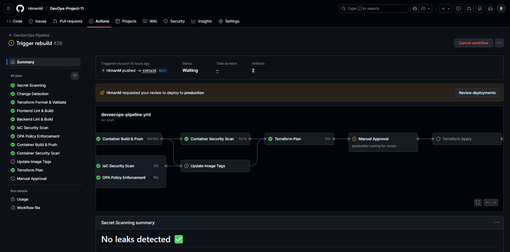

---

#### Job 12: Terraform Apply

**Purpose**: Deploy infrastructure changes to AWS.

**How it works**:
- Applies the approved Terraform plan
- Uses OIDC authentication (no stored credentials)
- Updates ECS services with new container images
- Creates/modifies AWS resources as defined

---

#### Job 13: Drift Detection

**Purpose**: Detect when actual infrastructure differs from defined state.

**How it works**:
- Runs `terraform plan` after deployment
- Compares AWS state to Terraform configuration
- Re-evaluates OPA policies against current state
- Alerts on unauthorized manual changes

---

#### Job 14: Update README and Tags

**Purpose**: Automated documentation and version management.

**How it works**:
- Updates `variables.tf` with new image SHA tags
- Updates README with deployment information
- Commits changes with `[skip ci]` to prevent loops
- Ensures documentation stays synchronized

---

## Security Concepts Implemented

### 1. Secret Detection (Gitleaks)

Prevents sensitive data from being committed to source control. Gitleaks scans for:
- AWS access keys and secret keys
- GitHub tokens and SSH private keys
- Database connection strings
- API keys and passwords

### 2. Static Application Security Testing (SAST)

ESLint with security plugins analyzes source code for vulnerabilities without executing it, identifying patterns that could lead to security issues.

### 3. Container Security

- **Trivy Scanning**: CVE detection for OS packages and dependencies
- **Non-root Users**: Containers run as unprivileged user (UID 1001)
- **Minimal Base Images**: Alpine Linux reduces attack surface
- **Multi-stage Builds**: Final images contain only runtime dependencies
- **Read-only Root Filesystem**: Prevents runtime modifications

### 4. Infrastructure as Code Security (Checkov)

Evaluates 400+ security policies against Terraform configurations, detecting misconfigurations before deployment.

### 5. Policy-as-Code (OPA/Rego)

Custom organizational policies defined in code that can be versioned and tested. Policies enforce rules like backend isolation and mandatory tagging.

### 6. OIDC Authentication

Passwordless authentication between GitHub Actions and AWS using identity federation. No long-lived credentials are stored in secrets.

### 7. Least Privilege IAM

Each component receives only the minimum permissions required:
- ECS Execution Role: ECR pull and CloudWatch logs only
- ECS Task Role: X-Ray and Secrets Manager access only
- GitHub Actions Role: Scoped to specific resources

### 8. Network Segmentation

Components isolated into security zones:
- **Public Subnets**: Only ALB exposed to internet
- **Private Subnets**: Backend services with no direct internet access
- **Security Groups**: Strict ingress/egress rules per component

### 9. Manual Approval Gates

GitHub Environments with required reviewers ensure human oversight before production deployments.

### 10. Drift Detection

Post-deployment verification compares actual infrastructure state to Terraform configuration, detecting unauthorized changes.

---

## Infrastructure Screenshots

### Frontend Application

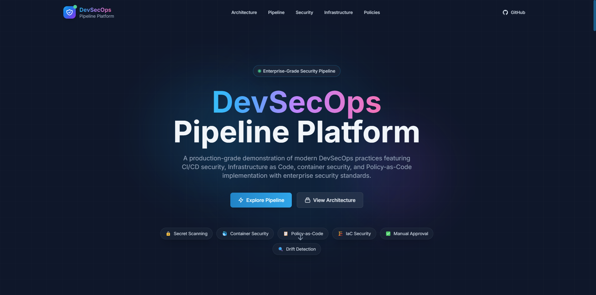

### Backend Connectivity

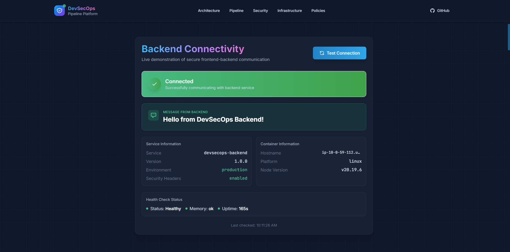

### ECS Services

| Frontend Service | Backend Service |
|------------------|-----------------|
| 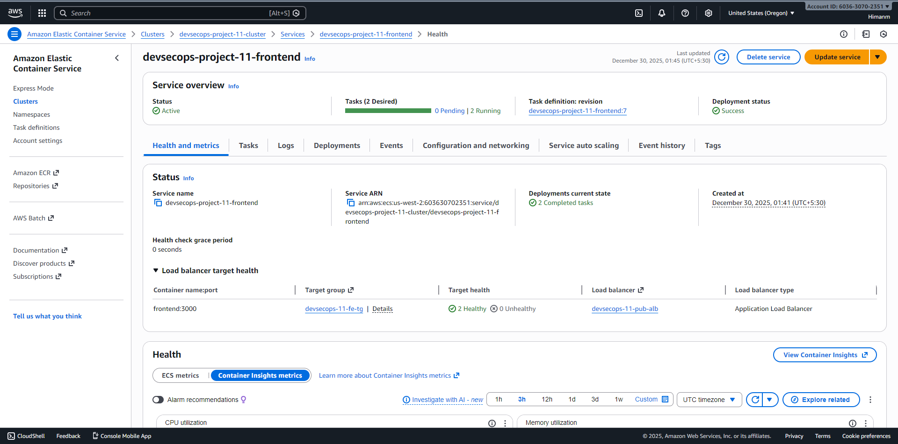 |  |

### Load Balancers

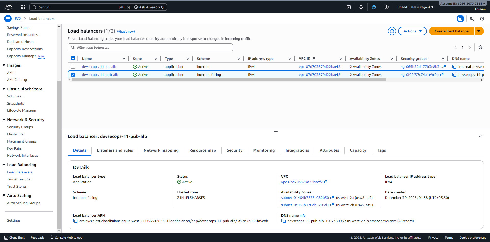

| Public ALB | Internal ALB |
|------------|--------------|
| 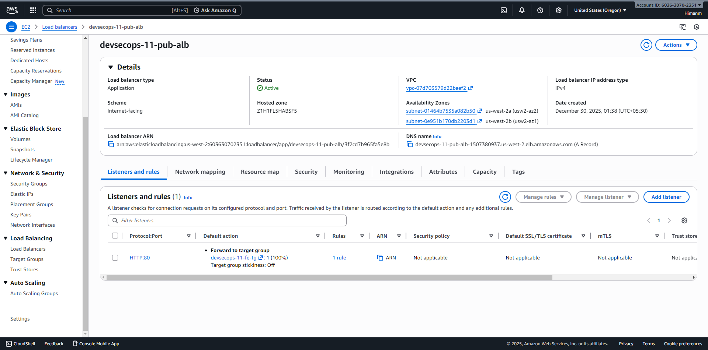 | 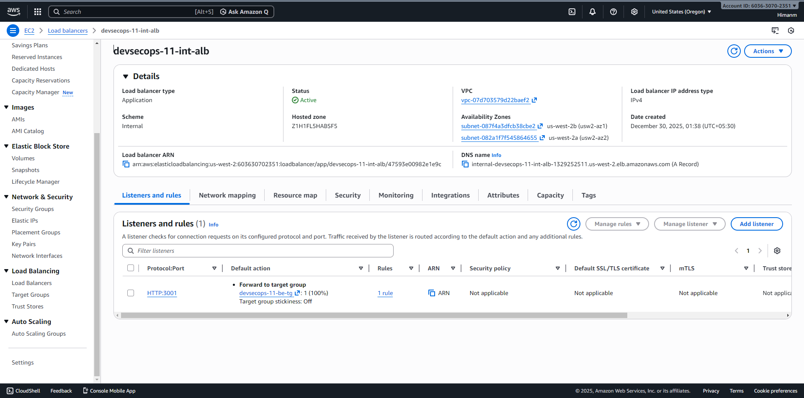 |

### Target Groups

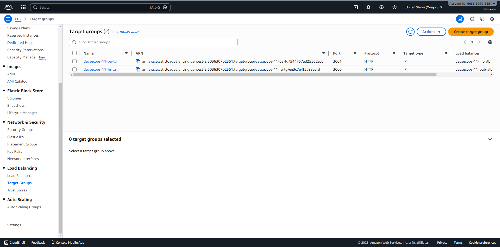

| Frontend Target Group | Backend Target Group |
|-----------------------|----------------------|
| 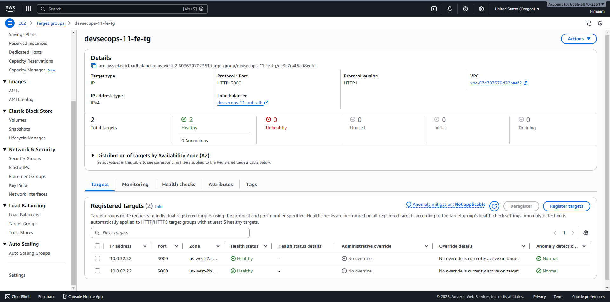 |  |

### ECS Cluster

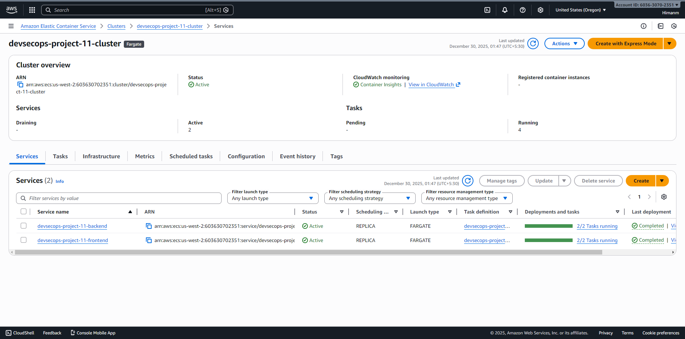

### IAM OIDC Provider

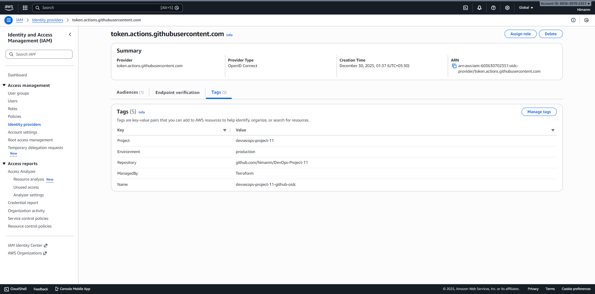

### Terraform Outputs


---

## How to Run Locally

### Prerequisites

- Node.js 20+
- Docker and Docker Compose
- Terraform 1.5+ (for infrastructure)
- AWS CLI configured (for deployment)

### Initial Setup (One-Time)

Before running the pipeline or Terraform for the first time:

1. **Create the S3 State Bucket**:
   ```bash
   aws s3 mb s3://devsecops-project-11-tfstate --region us-west-2
   ```

2. **Initial Container Build and Push**:
   ```bash
   # Login to GHCR
   echo $GITHUB_TOKEN | docker login ghcr.io -u YOUR_USERNAME --password-stdin

   # Build and push frontend
   docker build -t ghcr.io/your_username/devops-project-11-frontend:latest ./frontend
   docker push ghcr.io/your_username/devops-project-11-frontend:latest

   # Build and push backend
   docker build -t ghcr.io/your_username/devops-project-11-backend:latest ./backend
   docker push ghcr.io/your_username/devops-project-11-backend:latest
   ```

3. **Run Terraform Apply**:
   ```bash
   cd terraform
   terraform init
   terraform apply
   ```

After this initial setup, the CI/CD pipeline is fully automated.

### Running Locally

```bash
# Clone the repository
git clone https://github.com/HimanM/DevOps-Project-11.git
cd DevOps-Project-11

# Backend
cd backend && npm install && npm run dev
# Server runs at http://localhost:3001

# Frontend (new terminal)
cd frontend && npm install && npm run dev
# Application runs at http://localhost:3000
```

### Testing Security Tools Locally

```bash
# Secret scanning
docker run -v $(pwd):/path zricethezav/gitleaks detect --source /path

# Container scanning
trivy image devsecops-frontend:latest

# IaC scanning
cd terraform && checkov -d .

# OPA policies
conftest test tfplan.json --policy ../policies/
```

---

## Repository Structure

```
devops-project-11/
│
├── frontend/                    # Next.js frontend application
│   ├── src/
│   │   ├── app/                 # App Router pages
│   │   └── components/          # React components
│   ├── Dockerfile               # Multi-stage build (non-root)
│   └── .dockerignore
│
├── backend/                     # Express backend API
│   ├── src/
│   │   └── index.js             # Server with Helmet security
│   ├── Dockerfile               # Multi-stage build (non-root)
│   └── .dockerignore
│
├── terraform/                   # Infrastructure as Code
│   ├── providers.tf             # AWS provider config
│   ├── variables.tf             # Input variables
│   ├── vpc.tf                   # Network infrastructure
│   ├── security-groups.tf       # Least privilege network rules
│   ├── iam.tf                   # Least privilege IAM roles
│   ├── alb.tf                   # Load balancers (public + internal)
│   ├── ecs.tf                   # ECS cluster and services
│   └── outputs.tf               # Output values
│
├── policies/                    # OPA/Rego policies
│   ├── no_public_backend.rego   # Backend isolation enforcement
│   ├── no_open_security_groups.rego
│   └── mandatory_tags.rego      # Tagging requirements
│
├── docs/                        # Documentation and screenshots
│
├── .github/
│   └── workflows/
│       └── devsecops-pipeline.yml  # 14-job security pipeline
│
└── README.md                    # This file
```

---

## Configuration

### GitHub Secrets Required

| Secret | Description |
|--------|-------------|
| `AWS_ROLE_ARN` | IAM role ARN for OIDC authentication |
| `GITLEAKS_LICENSE` | (Optional) Gitleaks enterprise license |

### Setting Up OIDC Authentication

1. Bootstrap infrastructure locally:
   ```bash
   cd terraform
   terraform init
   terraform apply
   ```

2. Copy the `github_actions_role_arn` output

3. Add to GitHub Secrets:
   - Repository Settings → Secrets and variables → Actions
   - Add `AWS_ROLE_ARN` with the role ARN value

### Configure Manual Approval

1. Go to Repository Settings → Environments
2. Create environment named `production`
3. Enable "Required reviewers" and add yourself

---

## Infrastructure Teardown

```bash
# Destroy all resources
cd terraform
terraform destroy -auto-approve

# Delete S3 state bucket
aws s3 rm s3://devsecops-project-11-tfstate --recursive
aws s3 rb s3://devsecops-project-11-tfstate

# Clean local files
rm -rf .terraform/ terraform.tfstate*
```

---

## License

**MIT License** - Copyright (c) 2024 [HimanM](https://github.com/HimanM)

This project is free to use for **educational purposes**.

If you use this project as a learning resource or template, please maintain attribution by linking back to the original repository.

---

<p align="center">
  <strong>Built with security in mind</strong><br>
  <sub>A demonstration of enterprise-grade DevSecOps practices by <a href="https://github.com/HimanM">HimanM</a></sub>
</p>
